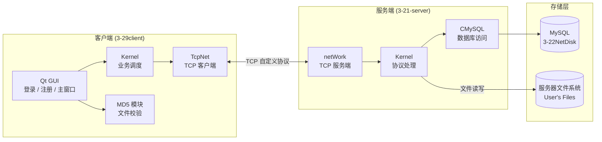
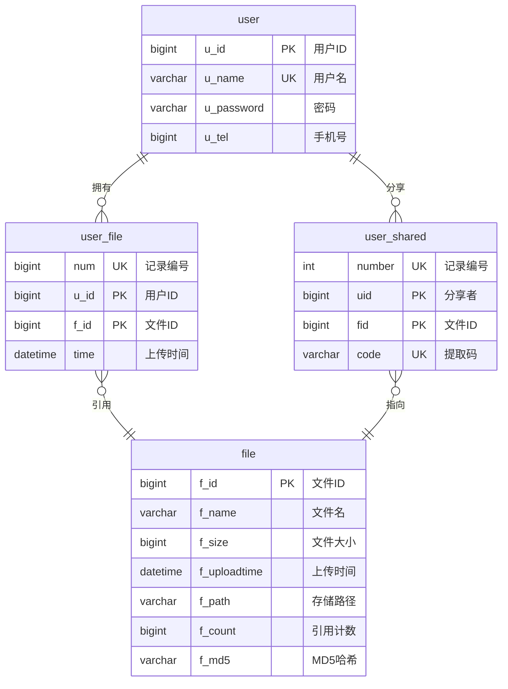

# NetDisk — 基于 Qt 的局域网云盘系统

<div align="center">

**Qt 5.15 · C++17 · TCP 自定义协议 · MySQL**

一个从零实现的客户端-服务端架构网络云盘，涵盖注册登录、文件上传下载、断点续传、秒传、搜索与分享的完整闭环。

</div>

---

## 系统架构



## 数据库 ER 图



## 功能矩阵

| 模块 | 功能 | 服务端 | 客户端 | 关键实现 |
|------|------|:---:|:---:|------|
| 账户 | 注册 | ✓ | ✓ | 自动创建用户专属文件夹 |
| 账户 | 登录 | ✓ | ✓ | 回传 userId 用于后续操作 |
| 文件 | 上传 | ✓ | ✓ | MD5 校验 → 分块传输（4096B/块） |
| 文件 | 秒传 | ✓ | - | f_md5 匹配已存在文件，跳过传输 |
| 文件 | 断点续传 | ✓ | ✓ | 记录 m_Pos 偏移，续传未完成部分 |
| 文件 | 下载 | ✓ | ✓ | 按文件名查 f_path → 分块回传 |
| 文件 | 删除 | ✓ | ✓ | 引用计数 >1 仅减计数，=1 物理删除 |
| 文件 | 搜索 | ✓ | ✓ | SQL LIKE 关键词模糊匹配 |
| 分享 | 生成链接 | ✓ | ✓ | 随机生成 10 位提取码，code UNIQUE |
| 分享 | 提取文件 | ✓ | ✓ | 校验提取码，自动插入 user_file 映射 |

## 通信协议

基于 TCP 的自定义二进制协议，每个数据包以 `m_nType` 字段标识类型。客户端与服务端共享同一份 `packdef.h`。

```
┌─────────────┬──────────────────────────────────────┐
│  m_nType    │         Payload（变长）                │
│  1 byte     │  具体结构取决于消息类型                 │
└─────────────┴──────────────────────────────────────┘
```

| 编号 | 消息 | 方向 | 核心字段 |
|:--:|------|:--:|------|
| 1 | 注册请求 REGISTER_RQ | C→S | szName, szPassword, szTel |
| 2 | 注册响应 REGISTER_RS | S→C | szResult |
| 3 | 登录请求 LOGIN_RQ | C→S | szName, szPassword |
| 4 | 登录响应 LOGIN_RS | S→C | szResult, szUserId |
| 5 | 文件列表请求 GETFILELIST_RQ | C→S | szUserId |
| 6 | 文件列表响应 GETFILELIST_RS | S→C | arrFileInfo[15], szFileNum |
| 7 | 上传信息请求 UPLOADFILEINFO_RQ | C→S | UserId, szFileName, szfileSize, szFileMD5 |
| 8 | 上传信息响应 UPLOADFILEINFO_RS | S→C | fileId, m_Pos, m_Result |
| 9 | 上传内容请求 UPLOADFILECONTENT_RQ | C→S | FileId, m_FIleContent[4096], m_FileNum |
| 13 | 搜索请求 SELECTFILE_RQ | C→S | UserId, m_KeyWord |
| 14 | 搜索响应 SELECTFILE_RS | S→C | arrFileInfo[15], szFileNum |
| 11 | 删除请求 DELETEFILE_RQ | C→S | userid, szFileName |
| 15 | 分享请求 SHARELINK_RQ | C→S | userid, szFileName |
| 16 | 分享响应 SHARELINK_RS | S→C | szCode, szFileName |
| 17 | 提取请求 GETLINK_RQ | C→S | userId, szCode |
| 18 | 提取响应 GETLINK_RS | S→C | szFileName, szFileSize, szResult |
| 19 | 下载请求 DOWNLOADFILE_RQ | C→S | userId, szFileName |
| 20 | 下载响应 DOWNLOADFILE_RS | S→C | m_FileContent[4096], m_fileNum |

> 上传流程：C→S 发 UPLOADFILEINFO_RQ → S 查 MD5 → 若已有则返回秒传/续传 → 否则 C 发 UPLOADFILECONTENT_RQ 分块传内容

## 项目结构

```
NetDisk/
│
├── 3-21-server/                  # 服务端（QCoreApplication）
│   ├── Kernel/                   # 业务核心：注册、登录、文件CRUD、分享
│   ├── netWork/                  # TCP 服务端：监听、Accept、收发
│   ├── CMySQL/                   # MySQL 封装：连接、查询、更新
│   ├── packdef.h                 # 通信协议（与客户端共享）
│   ├── init_database.sql         # 数据库建表脚本（mysqldump 导出）
│   ├── main.cpp                  # 入口
│   └── 3-21-server.pro
│
├── 3-29client/                   # 客户端（QMainWindow）
│   ├── Kernel/                   # 业务核心：信号槽转发网络响应
│   ├── TcpNet/                   # TCP 客户端：连接、收发
│   ├── MD5/                      # MD5 计算：文件摘要 → 秒传判断
│   ├── login.cpp/h/ui            # 登录界面
│   ├── register.cpp/h/ui         # 注册界面
│   ├── mainwindow.cpp/h/ui       # 主界面：文件表格 + 菜单操作
│   ├── dialog.cpp/h/ui           # 提取分享码对话框
│   ├── packdef.h                 # 通信协议（与服务端共享）
│   ├── image.qrc                 # UI 图标资源
│   ├── main.cpp                  # 入口
│   └── 3-29client.pro
│
├── .gitignore
└── README.md
```

## 快速开始

### 环境依赖

| 组件 | 版本/说明 |
|------|----------|
| Qt | 5.15.2（MinGW 64-bit） |
| 编译器 | MinGW 8.1.0 64-bit |
| 数据库 | MySQL 5.7+ |
| 构建 | qmake |
| 系统 | Windows |

### 1. 初始化数据库

```bash
mysql -u root -p < 3-21-server/init_database.sql
```

### 2. 配置连接

编辑 `3-21-server/Kernel/kernel.cpp` 中 `open()` 函数：

```cpp
m_pSql->ConnectMySql("127.0.0.1", "root", "your_password", "3-22NetDisk");
```

同时修改服务端文件存储路径：

```cpp
strcpy(m_szSystemPath, "D:/Qt project/Netdisk-UserFiles/User`s Files/");
```

### 3. 编译 & 运行

**先启动服务端：**

```bash
cd 3-21-server
qmake 3-21-server.pro
mingw32-make
# 运行生成的 3-21-server.exe
```

**再启动客户端：**

```bash
cd 3-29client
qmake 3-29client.pro
mingw32-make
# 运行生成的 3-29client.exe
```

### 4. 使用

1. 客户端打开 → 弹出登录窗口 → 点击注册新用户
2. 登录后进入主界面 → 菜单栏操作：上传、下载、删除、搜索、分享
3. 分享：右键文件 → 生成提取码 → 其他用户输入提取码获取文件

## 设计亮点

- **文件去重存储**：相同 MD5 的文件只存一份，通过 `f_count` 引用计数管理生命周期
- **秒传**：上传前先发 MD5 给服务端，命中则直接建立映射，零传输量
- **断点续传**：服务端返回 `m_Pos` 偏移量，客户端 `fseek` 后从断点继续
- **协议头 1 字节分发**：`dealData()` 通过 `switch(*szbuf)` 一键路由到处理函数
- **单例内核**：服务端 `Kernel` 饿汉式单例，全局唯一访问入口
- **Qt 信号槽异步**：客户端网络响应通过 `BlockingQueuedConnection` 跨线程投递到 UI 线程

## License

MIT
